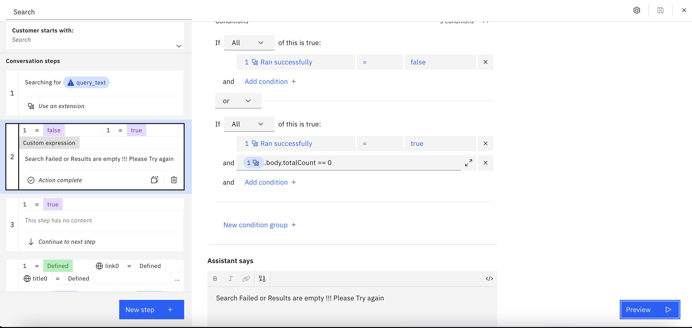
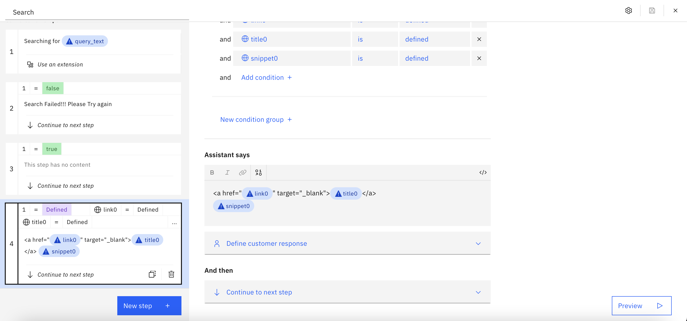
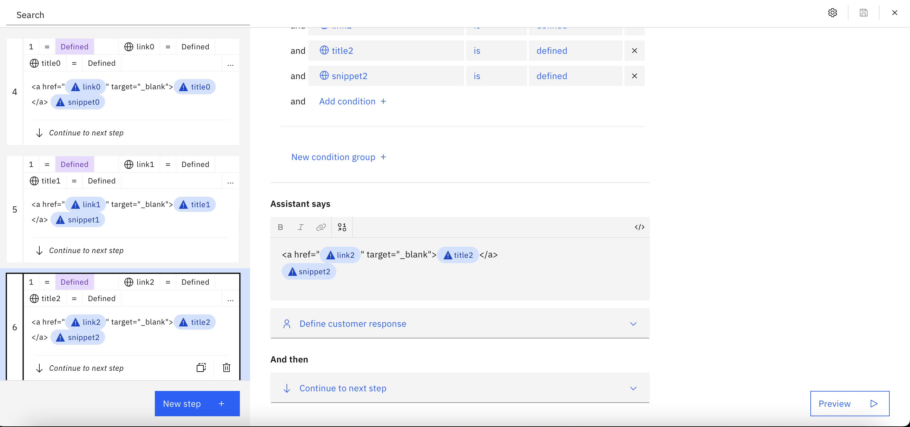

# Coveo Search

## Background

This is a starter kit for accessing the Coveo Search which lets you create and manage source documents and most importantly lets you perform search query on an index  [Coveo Search API](https://docs.coveo.com/en/52/build-a-search-ui/use-the-search-api) and is a configurable search that allows you to customize search features based on your use-case.

The OpenAPI spec in this starter kit includes the following endpoint:

- `GET /rest/search/v2`: Search for content relevant to a given query in set of sources or documents.


The endpoints are described in detail at:

1. **Search Query**: https://docs.coveo.com/en/1445/build-a-search-ui/perform-a-query

This starter kit exposes only the minimal functionality needed for simple use cases, and you will need to extend it if you want to cover more advanced ones.

## Pre-Requisite Steps

Follow the steps listed in the [Coveo Overview](https://docs.coveo.com/en/3361/coveo-overview) section to create the API key to identify your application.

## Other Setup Info

### Setup in a new Assistant

If you want to make a _new_ Assistant using this starter kit, take the following steps:

- Download the OpenAPI specification (`coveo.openapi.json`) and Actions JSON file (`coveo.actions.json`) in this starter kit.
- Use the OpenAPI specification to [build a custom extension](https://cloud.ibm.com/docs/watson-assistant?topic=watson-assistant-build-custom-extension#building-the-custom-extension).
- [Add the extension to your assistant](https://cloud.ibm.com/docs/watson-assistant?topic=watson-assistant-add-custom-extension) using the API key you obtained in the pre-requisites above.
- [Upload the Actions JSON file](https://cloud.ibm.com/docs/watson-assistant?topic=watson-assistant-admin-backup-restore#backup-restore-import).
- Use either method listed in [Configuring Your Actions Skill to use an Extension](https://github.com/watson-developer-cloud/assistant-toolkit/blob/master/integrations/extensions/README.md#configuring-your-actions-skill-to-use-an-extension) to configure the actions you uploaded to invoke the custom extension you built. Set the `q` parameter to the `query_text` session variable.


### Setup in a pre-existing Assistant

If you want to add this starter kit to an _existing_ assistant, you cannot use the Actions JSON file since it will overwrite your existing configuration.  So instead, follow the following process:

- Download the OpenAPI specification in this starter kit.
- Use the OpenAPI specification to [build a custom extension](https://cloud.ibm.com/docs/watson-assistant?topic=watson-assistant-build-custom-extension#building-the-custom-extension).
- [Add the extension to your assistant](https://cloud.ibm.com/docs/watson-assistant?topic=watson-assistant-add-custom-extension) using the API key you obtained in the pre-requisites step above.
- Go to `Variables > Created by you` and add `query_text`, `result_items` `link0`, `link1`, `link2`, `title0`, `title1`, `title2`, `snippet0`,`snippet1`, and `snippet2`.
- Create a new action and put "Search" in "What does your customer say to start this interaction?".  Add step 1:
    - Click the fX button to add a variable and add new session variable `query_text` and select "Expression" type and then put `input.text` or `input.original_text` as the expression.  The former will employ spelling correction to fix any detected spelling errors before sending the query, which can be helpful, but it can also be counterproductive if your documents include specialized terminology that is not in our dictionary (such as product names) so you can use `input.original_text` as the alternative in such cases.
    - Optional: In "Assistant says", put `Searching for: ${query_text}`
    - In "And then", select "Use an extension", select the extension you made back in step 2, and select the search endpoint and set the `q` parameter to the `query_text` session variable.

<br>
<br>

- Click "New Step" and change "without conditions" to "with conditions" and set "Ran successfully" to "false".  Also set "And then" to "End the action".  Then add the following to the "Assistant says":
  Sorry.  The search failed!  Please try again another time.

<br>


- Add a "New Step", then:
    - Change "without conditions" to "with conditions" and select "true" for "Ran successfully"
    - Click the fX button to add variables and add all the following new session variables, replacing `step_123_result_1` with the actual variable name and selecting "Expression" each time. For context on why we do this and what these mean, see [Extensions Made Easy with Watson Assistant Starter Kits](https://medium.com/ibm-watson/extensions-made-easy-with-watson-assistant-starter-kits-6b177f624697):
```
link0 = ${step_123_result_1}.body.items.get(0).clickUri
title0 = ${step_123_result_1}.body.items.get(0).title
snippet0 = ${step_123_result_1}.body.items.get(0).excerpt
link1 = ${step_123_result_1}.body.items.get(1).clickUri
title1 = ${step_123_result_1}.body.items.get(1).title
snippet1 = ${step_123_result_1}.body.items.get(1).excerpt
link2 = ${step_123_result_1}.body.items.get(2).clickUri
title2 = ${step_123_result_1}.body.items.get(2).title
snippet2 = ${step_123_result_1}.body.items.get(2).excerpt
```

<br>

- Click "New Step" and also change "without conditions" to "with conditions" and select "Ran successfully" is "true" and "link0" is "defined".  Then add the following to the "Assistant says":

```
<a href="${link0}">${title0}</a>
${snippet0}
```

<br>

- Click "New Step" and change "without conditions" to "with conditions" and select "Ran successfully" is "true" and "link1" is "defined".  Then add the following to the "Assistant says":

```
<a href="${link1}">${title1}</a>
${snippet1}
```

<br>

- Click "New Step" and change "without conditions" to "with conditions" and select "Ran successfully" is "true" and "link2" is "defined".  For this step, set "And then" to "End the action".  Then add the following to the "Assistant says":

```
<a href="${link2}">${title2}</a>
${snippet2}
```

<br>

- Close the action editor (by clicking X in the upper right)
- Go to "Actions" > "Set by assistant" > "No action matches" and remove all the steps from the action.  Add in a new step.  Under "And then" select "Go to another action" and select "Search" and click "End this action after the subaction is completed".
- You may also want to go to "Actions" > "Set by assistant" > "Fallback" and do the same thing as in the previous step.  Note, however, that this will prevent your assistant from escalating to a human agent when a customer asks to connect to a human agent (which is part of the default behavior for "Fallback") so only do this if you do not have your bot connected to a human agent chat service.  For more details on connecting to human agents within Watson Assistant see [our documentation](https://cloud.ibm.com/docs/watson-assistant?topic=watson-assistant-human-agent) and [blog post](https://medium.com/ibm-watson/bring-your-own-service-desk-to-watson-assistant-b39bc920075c).
- Go to the Search action and remove "Search" from the "Customer starts with" list so that the search action _only_ triggers via the "Go to another action" settings described in steps above.  If you skip this, then the "Search" action will also be considered by the intent recognizer as a possible intent, which adds unnecessary complexity to the intent recognition and thus could result in lower overall intent recognition accuracy.

## Using this Starter Kit

Once this starter kit is properly installed, you can issue a query to your bot and if there is no other action that you've configured that matched that query then it will generate search results for that query.

Feel free to contribute to this starter kit, or add other starter kits by following these [contribution guidelines](../../docs/CONTRIBUTING.md).